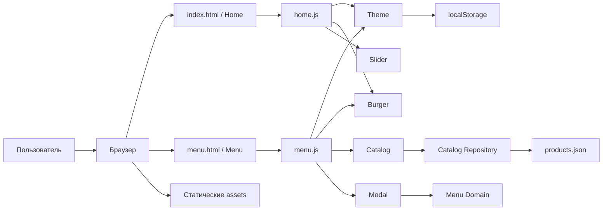
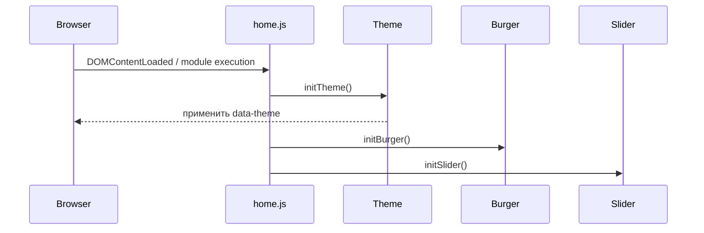
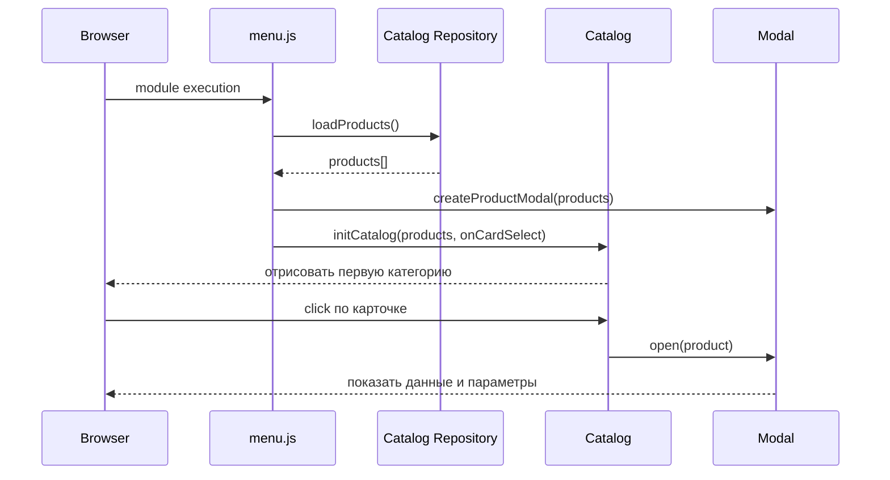
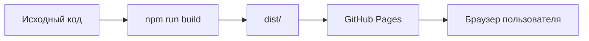
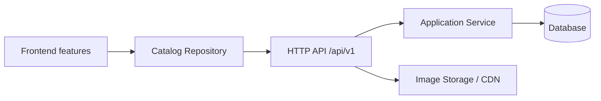

# Архитектура приложения Coffee House

## 1. Назначение документа

Документ описывает целевую архитектуру Coffee House Landing Page: структуру каталогов, границы модулей, направления зависимостей, управление состоянием, работу с данными, тестирование и деплой.

Архитектура рассчитана на текущий учебный проект и допускает дальнейшее развитие без преждевременного добавления backend, базы данных или сложного frontend-фреймворка.

Связанные документы:

- [Техническое задание](TermsOfReference.md)
- [Технологический стек](TechnologyStack.md)

## 2. Архитектурный стиль

Текущая версия приложения — статическое двухстраничное MPA-приложение:

- `index.html` — Home;
- `menu.html` — Menu;
- Vite — локальная разработка и production-сборка;
- HTML5, CSS3 и JavaScript ES Modules;
- каталог загружается из отдельного `products.json`;
- серверная логика и база данных отсутствуют;
- production-результат — каталог `dist/` со статическими файлами.

MPA выбран вместо SPA, потому что проект содержит только две самостоятельные страницы, не требует клиентского роутера и должен работать на простом статическом хостинге.

## 3. Общая схема



## 4. Границы системы

### 4.1. Frontend

Frontend отвечает за:

- отображение Home и Menu;
- светлую и тёмную темы;
- навигацию и burger menu;
- Favorites Coffee slider;
- загрузку и отображение каталога;
- переключение категорий;
- показ дополнительных карточек;
- modal позиции меню;
- выбор размера и добавок;
- расчёт и отображение итоговой цены;
- доступность и адаптивность.

### 4.2. Backend

В текущей версии backend отсутствует. Все данные публичны и доступны из статического JSON, а пользовательские операции не требуют серверной обработки.

Backend следует добавлять только при появлении реальных требований, например:

- управление ассортиментом через административную панель;
- корзина и оформление заказа;
- авторизация;
- серверное хранение предпочтений;
- интеграция с оплатой;
- аналитика, требующая собственного API.

### 4.3. База данных

В текущей версии база данных отсутствует. `products.json` является единственным источником каталога.

База данных потребуется только вместе с backend и изменяемыми серверными данными. До этого момента схема БД, ORM и миграции не проектируются.

## 5. Структура каталогов

```text
Project coffee/
├── index.html
├── menu.html
├── package.json
├── package-lock.json
├── vite.config.js
├── eslint.config.js
├── .prettierrc.json
├── README.md
│
├── public/
│   ├── favicon.svg
│   ├── data/
│   │   └── products.json
│   └── assets/
│       └── menu/
│           ├── coffee/
│           ├── tea/
│           └── dessert/
│
├── src/
│   ├── assets/
│   │   ├── fonts/
│   │   ├── icons/
│   │   └── images/
│   │       ├── hero/
│   │       ├── favorites/
│   │       ├── about/
│   │       └── mobile-app/
│   │
│   ├── styles/
│   │   ├── tokens.css
│   │   ├── fonts.css
│   │   ├── reset.css
│   │   ├── base.css
│   │   ├── layout.css
│   │   ├── utilities.css
│   │   ├── components/
│   │   │   ├── header.css
│   │   │   ├── footer.css
│   │   │   ├── buttons.css
│   │   │   ├── cards.css
│   │   │   ├── modal.css
│   │   │   └── theme-toggle.css
│   │   └── pages/
│   │       ├── home.css
│   │       └── menu.css
│   │
│   └── js/
│       ├── entries/
│       │   ├── home.js
│       │   └── menu.js
│       ├── data/
│       │   └── catalog-repository.js
│       ├── domain/
│       │   └── menu-item.js
│       ├── features/
│       │   ├── theme/
│       │   │   └── theme.js
│       │   ├── burger/
│       │   │   └── burger.js
│       │   ├── slider/
│       │   │   └── slider.js
│       │   ├── catalog/
│       │   │   ├── catalog.js
│       │   │   └── product-card.js
│       │   └── modal/
│       │       └── product-modal.js
│       └── shared/
│           ├── dom.js
│           ├── focus-trap.js
│           ├── scroll-lock.js
│           └── storage.js
│
├── tests/
│   ├── unit/
│   ├── integration/
│   └── e2e/
│
├── docs/
│   ├── TermsOfReference.md
│   ├── TechnologyStack.md
│   └── acchitecture.md
│
└── .codex/
    └── rules/
```

Структура является целевой. Файлы создаются по мере появления функциональности, а не заранее пустыми заготовками.

## 6. Назначение основных частей

### 6.1. HTML entry points

`index.html` и `menu.html` содержат семантическую разметку страниц и подключают соответствующие entry-модули.

Header и footer повторяются в двух HTML-документах намеренно:

- содержимое доступно без JavaScript;
- отсутствует вспышка пустой разметки;
- не требуется шаблонизатор или runtime-загрузка HTML-фрагментов;
- статические страницы остаются простыми для хостинга.

Поведение и стили header/footer общие. При изменении разметки оба документа обновляются в рамках одной задачи и проверяются совместно.

### 6.2. Entry-модули

`home.js` и `menu.js` являются composition root соответствующих страниц.

`home.js` инициализирует:

- theme;
- burger;
- slider.

`menu.js` инициализирует:

- theme;
- burger;
- catalog;
- modal.

Entry-модули связывают функции между собой, но не содержат бизнес-логику или большую DOM-разметку.

### 6.3. Features

Каждая feature отвечает за один пользовательский сценарий:

- `theme` — тема и `localStorage`;
- `burger` — мобильная навигация;
- `slider` — переключение favorites;
- `catalog` — категории, карточки и их количество;
- `modal` — окно выбранной позиции, параметры и доступность.

Feature может использовать `shared`, `domain` и `data`, но не должна напрямую менять внутреннее состояние другой feature.

### 6.4. Domain

`domain/menu-item.js` содержит чистую логику, не зависящую от DOM:

- получение базовой цены;
- расчёт цены размера;
- суммирование добавок;
- форматирование результата для отображения;
- получение начального состояния параметров.

Чистая domain-логика покрывается unit-тестами.

### 6.5. Data

`catalog-repository.js` — единственная точка загрузки каталога.

Ответственность:

- сформировать корректный URL `products.json`;
- выполнить `fetch`;
- проверить HTTP-ответ;
- вернуть массив данных;
- передать ошибку вызывающему коду без скрытого fallback на выдуманные данные.

UI не вызывает `fetch` напрямую. Благодаря этой границе статический JSON позже можно заменить API без изменения карточек и modal.

### 6.6. Shared

В `shared` размещается только код, реально используемый минимум двумя features:

- безопасный поиск обязательных DOM-элементов;
- блокировка прокрутки;
- focus trap;
- обёртка над хранением темы.

Нельзя превращать `shared` в каталог случайных функций. Одноразовая логика остаётся внутри feature.

## 7. Правила зависимостей

Допустимое направление зависимостей:

```text
entries → features → domain
                  ↘ data
                  ↘ shared

data     → browser APIs
shared   → browser APIs
domain   → без внешних зависимостей
```

Правила:

1. `domain` не импортирует DOM, features, data или storage.
2. `data` не создаёт HTML и не управляет UI.
3. `shared` не импортирует features.
4. Features не импортируют entry-модули.
5. Entry-модули выполняют только сборку страницы и передачу зависимостей.
6. Циклические импорты запрещены.
7. Между features не используется глобальная шина событий без реальной необходимости.

## 8. Взаимодействие модулей

### 8.1. Инициализация Home



### 8.2. Инициализация Menu



### 8.3. Пересчёт цены

```text
modal UI
  → выбранный product
  → выбранный size
  → выбранные additives
  → domain.calculateTotal()
  → formatPrice()
  → обновление одного price-элемента
```

Расчёт не читает значения из текста DOM. UI передаёт domain-модулю структурированные данные.

## 9. Управление состоянием

Глобальный store не используется.

| Состояние | Владелец | Время жизни | Сохранение |
| --- | --- | --- | --- |
| Тема | `theme` | Между страницами | `localStorage` |
| Burger open/closed | `burger` | До закрытия/перехода | Нет |
| Активный слайд | `slider` | До перезагрузки | Нет |
| Активная категория | `catalog` | До перезагрузки | Нет |
| Карточки expanded | `catalog` | До смены категории/resize | Нет |
| Выбранный product | `modal` | Пока modal открыт | Нет |
| Size/additives | `modal` | Пока modal открыт | Нет |

Состояние хранится внутри замыканий feature-модулей. DOM отражает состояние, но не является его единственным источником.

## 10. Тема

Тема применяется атрибутом на корневом элементе:

```html
<html data-theme="light">
```

CSS-токены определяются в `tokens.css` для обеих тем. Theme-модуль:

1. читает сохранённое значение;
2. проверяет допустимость `light` или `dark`;
3. применяет тему;
4. обновляет `aria-pressed` или другое выбранное состояние переключателя;
5. сохраняет выбор пользователя.

В `localStorage` хранится только строковое значение темы. Ошибка доступа к storage не должна ломать страницу: приложение продолжает работу с темой по умолчанию.

## 11. Каталог и JSON

`public/data/products.json` сохраняется отдельным runtime-файлом и копируется Vite в `dist/data/products.json`.

Преимущества:

- выполняется требование отдельного источника данных;
- каталог можно обновить без изменения HTML;
- структуру легко заменить ответом API;
- данные карточки и modal не дублируются.

Путь загружается относительно текущей страницы или через базовый URL Vite, чтобы приложение работало как в корне домена, так и под префиксом GitHub Pages.

Состояния загрузки:

- loading — контейнер помечен как занятый;
- success — отображается первая категория;
- error — отображается понятное сообщение без фиктивных карточек, ошибка остаётся видна в Console.

## 12. Разметка и рендеринг

### 12.1. Статическая разметка

В HTML остаются:

- структура страниц;
- header и footer;
- секции Home;
- контейнеры и элементы управления Menu;
- пустой контейнер списка карточек;
- корневой контейнер modal или `<dialog>`, если его поведение соответствует макету и требованиям.

### 12.2. Динамическая разметка

JavaScript создаёт:

- карточки каталога;
- содержимое modal;
- варианты Size и Additives;
- состояния загрузки и ошибки.

Для повторяющихся компонентов используются небольшие функции создания элементов или `<template>`. Большой HTML не хранится одной нечитабельной строкой.

## 13. Стили

### 13.1. Слои CSS

Порядок подключения:

1. fonts;
2. reset;
3. tokens;
4. base;
5. layout;
6. components;
7. page-specific styles;
8. utilities.

Допускается применение CSS Cascade Layers, если они поддерживаются выбранной конфигурацией и реально упрощают порядок каскада.

### 13.2. Адаптивность

Основная адаптивность реализуется CSS. JavaScript реагирует на ширину только там, где меняется поведение:

- закрытие burger при переходе к Desktop;
- пересчёт количества видимых карточек;
- корректировка slider, если она нужна его геометрии.

Контрольные ширины: 1440, 768 и 380 px. Промежуточные значения также должны работать без отдельных layout-версий для каждого размера.

### 13.3. Именование

Используются понятные компонентные классы. Допускается упрощённый BEM:

```text
.product-card
.product-card__image
.product-card__content
.product-card--interactive
```

Классы для JavaScript имеют префикс `js-` или заменяются `data-*` атрибутами. Стили не должны зависеть от `js-` классов.

## 14. Доступность

Архитектурные требования:

- нативные интерактивные элементы используются раньше ARIA;
- burger синхронизирует `aria-expanded`;
- категории реализуются доступными кнопками, а выбранное состояние объявляется;
- modal имеет доступное имя, управление Escape, focus trap и возврат фокуса;
- при блокировке прокрутки клавиатурный focus не попадает в фон;
- slider имеет доступные названия кнопок и объявляет активный элемент;
- все функции доступны без мыши;
- `prefers-reduced-motion` отключает необязательное движение.

## 15. Обработка ошибок

- Отсутствие обязательного DOM-узла выявляется при инициализации с понятным сообщением разработчику.
- Ошибка каталога отображается пользователю в области списка.
- Ошибка `localStorage` не блокирует интерфейс.
- Ошибка отдельного изображения обрабатывается браузером; обязательные ресурсы дополнительно проверяются перед сборкой.
- Ошибки не скрываются пустыми `catch`.
- Пользователю не показывается stack trace.

## 16. Тестовая архитектура

### 16.1. Unit

Тестируются чистые функции:

- расчёт цены;
- переход slider по кругу;
- выбор категории;
- расчёт количества карточек;
- нормализация темы.

### 16.2. Integration

В jsdom проверяются:

- рендер карточек из данных;
- переключение категорий;
- открытие и закрытие modal;
- параметры modal;
- синхронизация ARIA;
- тема и storage adapter.

### 16.3. E2E

В Playwright проверяются критические пользовательские сценарии на 1440, 768 и 380 px:

- Home ↔ Menu;
- сохранение темы;
- burger на обеих страницах;
- slider;
- категории и дополнительные карточки;
- modal, клавиатура и пересчёт цены;
- отсутствие горизонтальной прокрутки;
- ошибки Console и Network.

## 17. Сборка

Vite работает в multi-page режиме и включает в production-сборку `index.html` и `menu.html`.

Требования к сборке:

- source maps включены;
- ссылки работают с base path репозитория;
- `products.json` доступен после сборки;
- статические пути не зависят от абсолютного корня домена;
- результат не содержит исходных PDF;
- в `dist/` нет тестов, документации и временных файлов;
- сборка воспроизводится одной командой.

`dist/` является генерируемым результатом и не редактируется вручную.

## 18. Деплой

### 18.1. Текущий вариант

Основной вариант — GitHub Pages.



Деплоится только содержимое `dist/`. Публичный URL проверяется в режиме инкогнито.

### 18.2. Перенос на обычный сервер

Та же сборка может размещаться на:

- Nginx;
- Apache;
- Cloudflare Pages;
- Netlify;
- Vercel как статический сайт;
- S3-совместимом storage с CDN.

Серверу достаточно отдавать статические файлы. SPA fallback не нужен, потому что используются реальные `index.html` и `menu.html`.

Рекомендуемая политика кеширования:

- HTML и `products.json` — короткий cache или revalidation;
- хешированные CSS, JS, fonts и images — длительный immutable cache;
- favicon и manifest — cache с revalidation.

## 19. Будущее расширение backend

Backend не добавляется заранее. Если он станет необходим, переход выполняется поэтапно:

1. сохранить контракт `loadProducts()` на frontend;
2. заменить URL JSON на `/api/v1/products`;
3. оставить формат объектов совместимым или добавить явное преобразование DTO;
4. развернуть API под тем же доменом или настроить разрешённый CORS;
5. только после появления изменяемых данных выбрать БД.

Будущая схема:



В frontend не должны попадать:

- данные подключения к БД;
- секретные API-ключи;
- серверная валидация как единственная защита;
- внутренняя модель БД без DTO-контракта.

### 19.1. Когда выбирать базу данных

БД выбирается после появления конкретных сценариев записи и запросов. Для каталога, заказов и пользователей вероятным кандидатом будет реляционная БД, но PostgreSQL не фиксируется до появления backend-ТЗ.

### 19.2. Разделение деплоя в будущем

При появлении backend рекомендуемая схема:

- frontend — статический CDN;
- API — отдельный сервис;
- изображения — object storage/CDN;
- БД — управляемый сервис в закрытой сети;
- конфигурация API URL — build-time переменная без секретов.

## 20. Производительность

- Критический CSS остаётся небольшим.
- Шрифты хранятся в WOFF2 и подключаются только нужными начертаниями.
- Основной шрифт предварительно загружается при доказанной пользе.
- Hero-изображение получает корректный приоритет загрузки.
- Изображения ниже первого экрана используют `loading="lazy"`.
- Для изображений задаются размеры или `aspect-ratio`, чтобы избежать layout shift.
- Растровые ресурсы оптимизируются без заметной потери качества.
- JavaScript разделён по entry points, поэтому Menu-код не загружается на Home без необходимости.
- Не добавляются зависимости ради короткой нативной реализации.

## 21. Безопасность

Для текущего статического приложения:

- отсутствуют секреты в клиентском коде;
- данные каталога считаются недоверенными при вставке в DOM;
- пользовательские строки вставляются через `textContent`, а не `innerHTML`;
- внешние ссылки с `target="_blank"` используют безопасный `rel`;
- `localStorage` содержит только тему;
- зависимости фиксируются lock-файлом и обновляются осознанно;
- production-сборка не содержит `.env`, тестовые данные и локальные пути.

## 22. Архитектурные решения

| Решение | Обоснование |
| --- | --- |
| MPA вместо SPA | Две страницы, реальные URL, нет необходимости в router |
| Vanilla JavaScript | Обязательное требование задания |
| Feature-модули | Изоляция сценариев без тяжёлой слоистой архитектуры |
| Локальное состояние | Нет необходимости в глобальном store |
| Repository для каталога | Простая замена JSON на API в будущем |
| Чистый domain расчёта цены | Тестируемость без DOM |
| Статический JSON | Backend и БД сейчас не нужны |
| Vite | Multi-page сборка, dev server и переносимый `dist/` |
| Дублирование общей HTML-разметки двух страниц | Доступность без JS и отсутствие шаблонизатора |
| GitHub Pages как первый хостинг | Соответствие учебному процессу и статической архитектуре |

## 23. Запрещённые архитектурные усложнения

Без нового требования не добавляются:

- frontend-фреймворк;
- клиентский router;
- глобальный state manager;
- dependency injection container;
- event bus;
- backend;
- база данных;
- ORM;
- микросервисы;
- SSR;
- GraphQL;
- Docker только ради статической разработки;
- абстракции с единственной реализацией, кроме минимальной границы каталога.

## 24. Критерии соответствия архитектуре

Архитектура соблюдена, если:

1. обе страницы имеют отдельные HTML entry points;
2. entry-модули только собирают features;
3. интерактивность разделена по пользовательским сценариям;
4. расчёт цены не зависит от DOM;
5. каталог загружается через одну data-границу;
6. глобальный store отсутствует;
7. тема — единственное состояние в `localStorage`;
8. циклические импорты отсутствуют;
9. Home не загружает код каталога и modal;
10. production-сборка переносима между статическими хостингами;
11. frontend готов заменить JSON на API без переписывания карточек и modal;
12. backend и БД не создаются до появления реальных требований.
